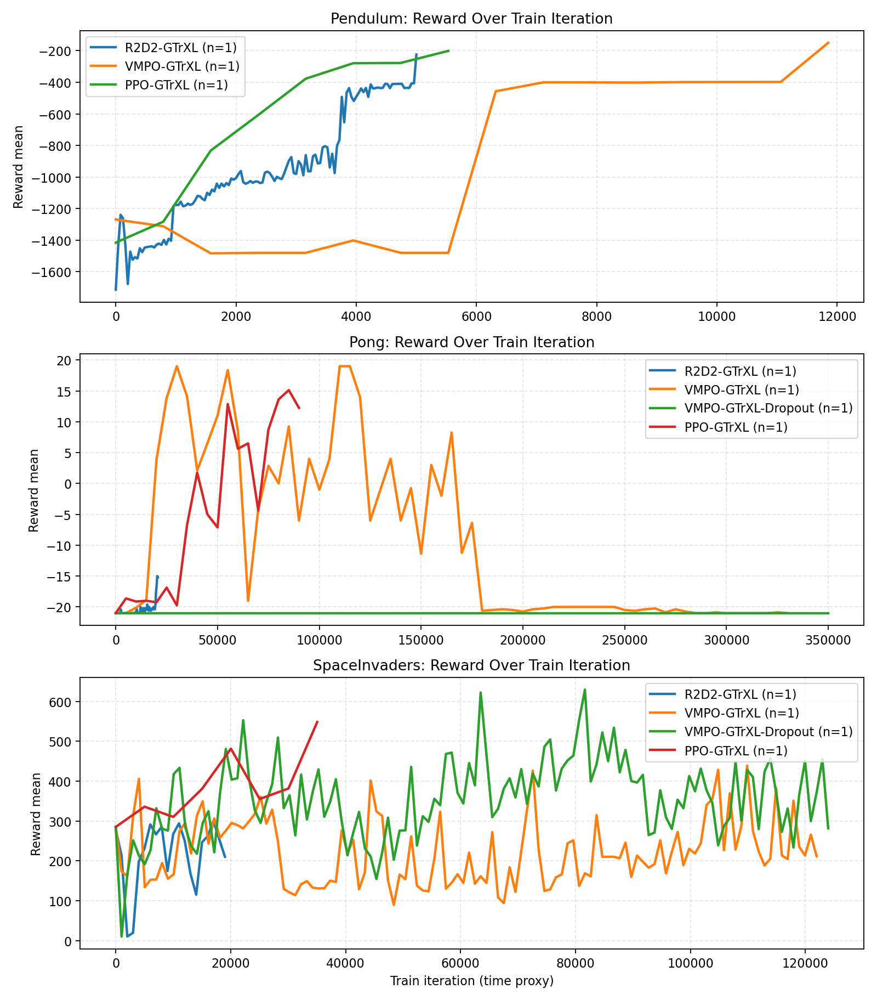

# GTrXL Benchmark Report

- Generated: `2026-02-28 15:23:39`
- Base directory: `/net/scratch/mbax2an2/DI-engine`

## Score Over Time

X-axis uses train iteration as a time-weighted proxy.
Each line is the seed-aggregated mean evaluator reward for one algorithm.

## Max Score by Algorithm

| Environment | R2D2-GTrXL | VMPO-GTrXL | VMPO-GTrXL-Dropout | PPO-GTrXL |
| --- | ---: | ---: | ---: | ---: |
| Pendulum | -224.887 | -150.366 | N/A | -201.721 |
| Pong | -15.000 | 19.000 | -21.000 | 15.125 |
| SpaceInvaders | 300.000 | 438.750 | 629.375 | 548.125 |

## Iterations to Reach Best Score

| Environment | R2D2-GTrXL | VMPO-GTrXL | VMPO-GTrXL-Dropout | PPO-GTrXL |
| --- | ---: | ---: | ---: | ---: |
| Pendulum | 5,000 | 11,850 | N/A | 5,530 |
| Pong | 20,368 | 30,000 | 0 | 85,000 |
| SpaceInvaders | 17,000 | 109,872 | 81,648 | 35,056 |

## Coverage

| Environment | Algorithm | Parsed Runs |
| --- | --- | ---: |
| Pendulum | R2D2-GTrXL | 1 |
| Pendulum | VMPO-GTrXL | 1 |
| Pendulum | VMPO-GTrXL-Dropout | 0 |
| Pendulum | PPO-GTrXL | 1 |
| Pong | R2D2-GTrXL | 1 |
| Pong | VMPO-GTrXL | 1 |
| Pong | VMPO-GTrXL-Dropout | 1 |
| Pong | PPO-GTrXL | 1 |
| SpaceInvaders | R2D2-GTrXL | 1 |
| SpaceInvaders | VMPO-GTrXL | 1 |
| SpaceInvaders | VMPO-GTrXL-Dropout | 1 |
| SpaceInvaders | PPO-GTrXL | 1 |

## Parsed Logs

- `/net/scratch/mbax2an2/DI-engine/pendulum_ppo_gtrxl_seed0/log/evaluator/evaluator_logger.txt` (Pendulum, PPO-GTrXL, seed=0, points=8)
- `/net/scratch/mbax2an2/DI-engine/pendulum_r2d2_gtrxl_seed0/log/evaluator/evaluator_logger.txt` (Pendulum, R2D2-GTrXL, seed=0, points=126)
- `/net/scratch/mbax2an2/DI-engine/pendulum_vmpo_gtrxl_seed0/log/evaluator/evaluator_logger.txt` (Pendulum, VMPO-GTrXL, seed=0, points=16)
- `/net/scratch/mbax2an2/DI-engine/pong_ppo_gtrxl_seed0/log/evaluator/evaluator_logger.txt` (Pong, PPO-GTrXL, seed=0, points=19)
- `/net/scratch/mbax2an2/DI-engine/pong_r2d2_gtrxl_seed0/log/evaluator/evaluator_logger.txt` (Pong, R2D2-GTrXL, seed=0, points=69)
- `/net/scratch/mbax2an2/DI-engine/pong_vmpo_gtrxl_seed0/log/evaluator/evaluator_logger.txt` (Pong, VMPO-GTrXL, seed=0, points=67)
- `/net/scratch/mbax2an2/DI-engine/pong_vmpo_gtrxl_dropout_seed0/log/evaluator/evaluator_logger.txt` (Pong, VMPO-GTrXL-Dropout, seed=0, points=71)
- `/net/scratch/mbax2an2/DI-engine/spaceinvaders_ppo_gtrxl_seed0/log/evaluator/evaluator_logger.txt` (SpaceInvaders, PPO-GTrXL, seed=0, points=8)
- `/net/scratch/mbax2an2/DI-engine/spaceinvaders_r2d2_gtrxl_seed0/log/evaluator/evaluator_logger.txt` (SpaceInvaders, R2D2-GTrXL, seed=0, points=20)
- `/net/scratch/mbax2an2/DI-engine/spaceinvaders_vmpo_gtrxl_seed0/log/evaluator/evaluator_logger.txt` (SpaceInvaders, VMPO-GTrXL, seed=0, points=122)
- `/net/scratch/mbax2an2/DI-engine/spaceinvaders_vmpo_gtrxl_dropout_seed0/log/evaluator/evaluator_logger.txt` (SpaceInvaders, VMPO-GTrXL-Dropout, seed=0, points=124)

_Report path: `/net/scratch/mbax2an2/DI-engine/reports/report_20260228_152334`_
